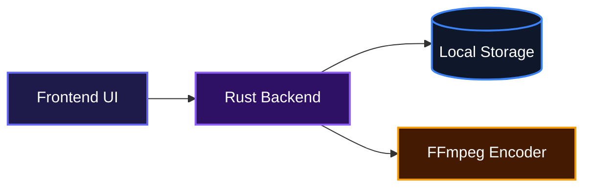
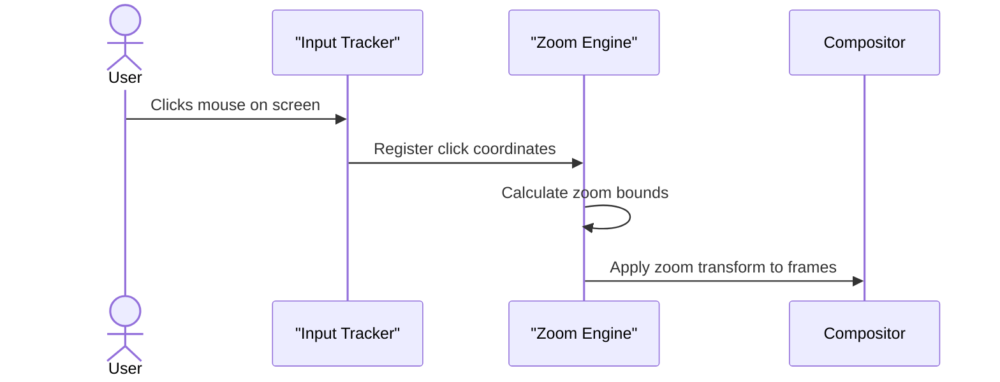
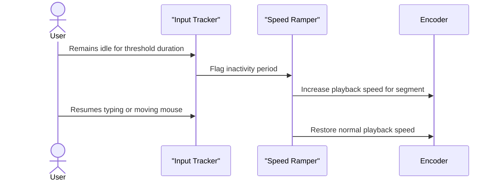

# Revate

A local-first, open-source screen recorder and auto-editor that transforms raw screen captures into polished, shareable videos automatically.

## Overview

Revate helps creators produce clean, engaging videos by automatically editing raw screen captures. It tracks user activity during recording and applies smart zooms, speed ramps, and sound effects to create a polished final product. Everything happens locally without complicated editing software or cloud uploads.

## System Architecture



## Features

* **Auto-Zoom**: Automatically zooms into areas of interest based on mouse clicks and dwell time.



* **Activity-Aware Speed Ramping**: Detects idle periods and automatically speeds up the footage to keep viewers engaged.



* **Smart Redaction**: Allows users to mark sensitive areas during recording to automatically blur them in the final output.
* **Auto-SFX**: Automatically mixes subtle click and typing sound effects into the final audio track for a more engaging presentation.
* **Offline First**: All processing runs locally on the machine to guarantee data privacy.

## Installation

Follow these steps to set up the project locally.

Clone the repository:
```bash
git clone https://github.com/thevalidcode/Revate.git
```

Navigate into the project directory:
```bash
cd Revate
```

Install the required dependencies:
```bash
pnpm install
```

Start the application in development mode:
```bash
pnpm tauri dev
```

## Usage

Users can start a recording session by selecting their target display and clicking the record button. The application captures screen data, input events, and audio simultaneously. Once the recording is stopped, the editor interface opens automatically to handle the export process.

To build the application for production release, use the following command:
```bash
pnpm tauri build
```

## Technologies Used

| Technology | Description |
|------------|-------------|
| [](https://www.typescriptlang.org/) | Type-safe frontend development |
| [](https://reactjs.org/) | User interface library |
| [](https://www.rust-lang.org/) | High-performance backend engine |
| [](https://tauri.app/) | Desktop application framework |

## Contributing

Contributions are welcome to help improve the project. Developers can submit pull requests with bug fixes, feature implementations, or documentation updates. Please ensure all new code follows the existing style guidelines and passes standard formatting checks.

## License

This project is licensed under the MIT License. See the [LICENSE](./LICENSE) file for complete details.

## Author Info

* LinkedIn: [https://linkedin.com/in/thevalidcode](https://linkedin.com/in/thevalidcode)
* X: [https://x.com/thevalidcode](https://x.com/thevalidcode)

[](https://dokugen.samueltuoyo.com)